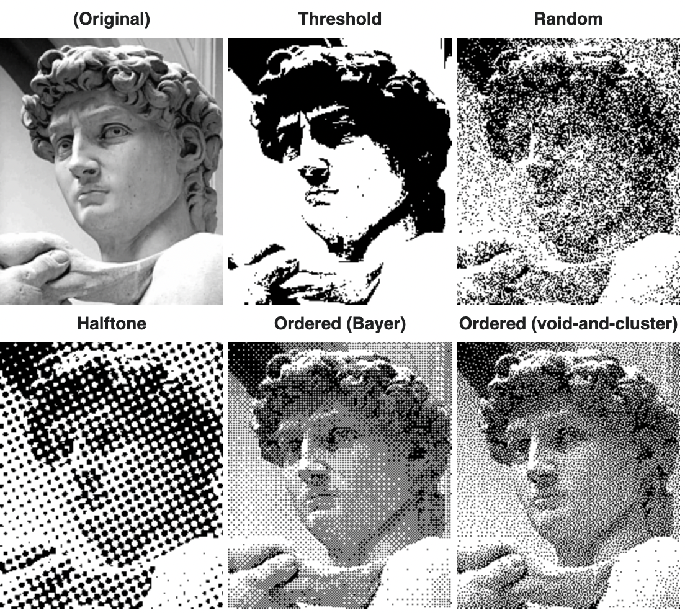
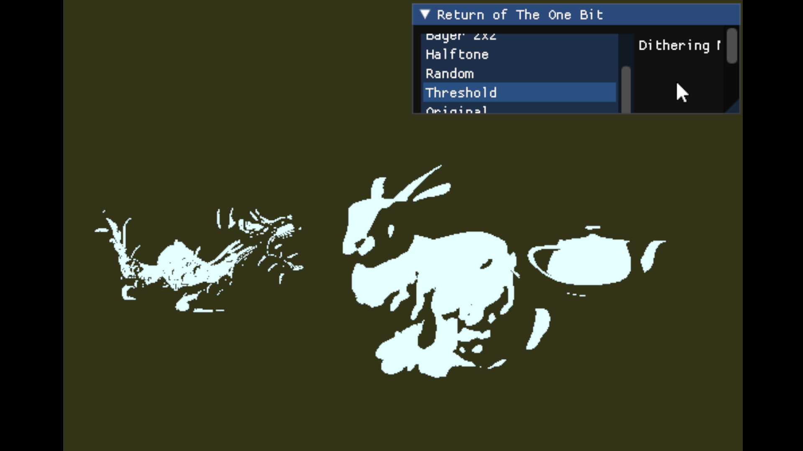
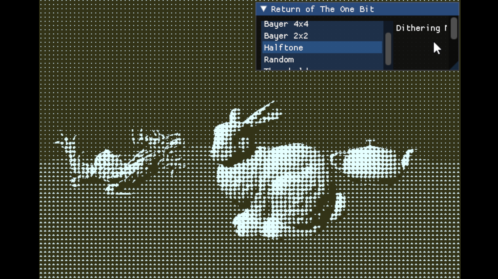
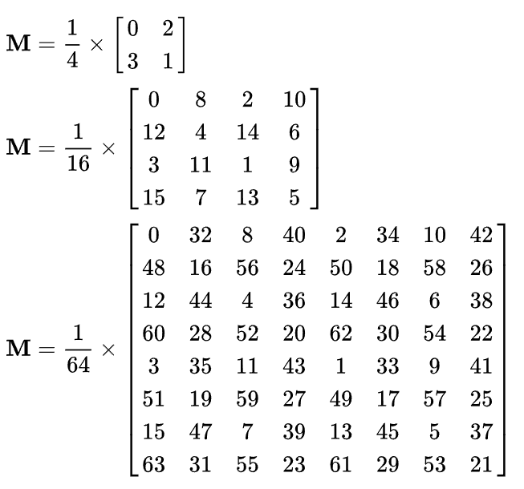
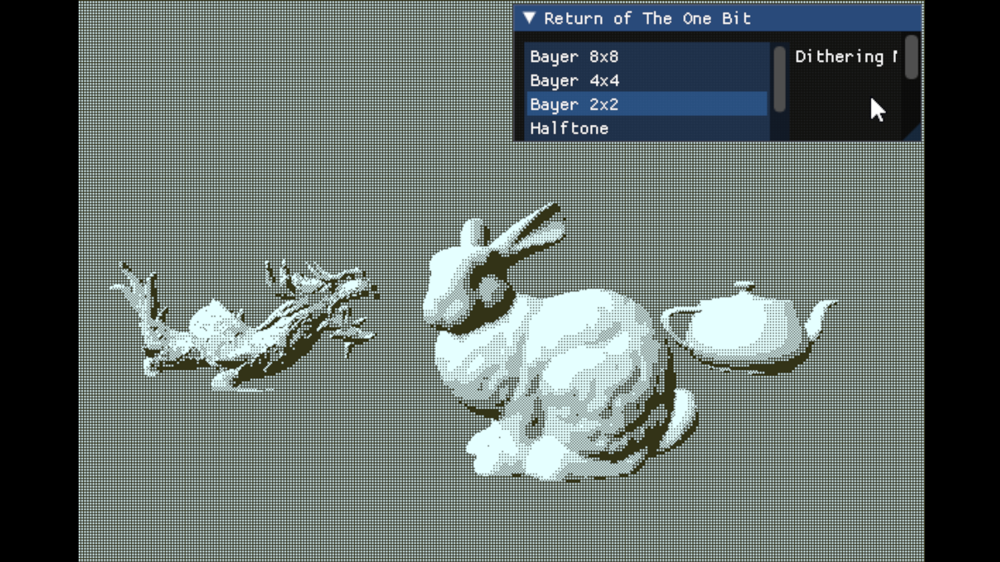
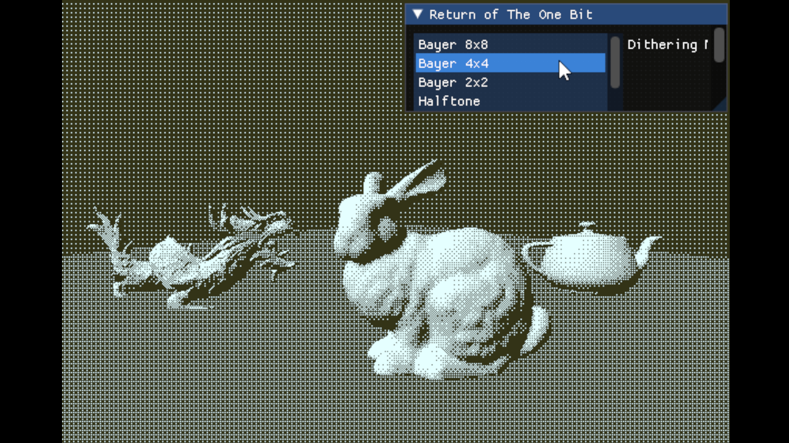
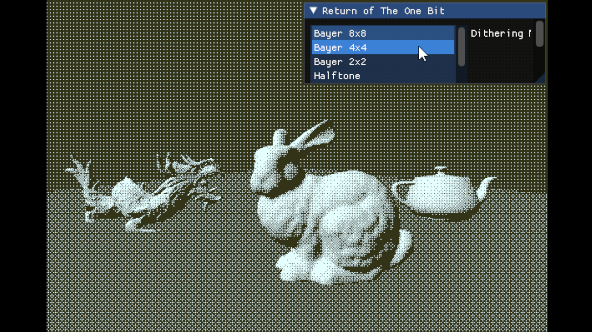

# Return of the One Bit

3D rendering showcase of dithering shaders inspired by the game *Return of the Obra Dinn* by Lucas Pope, which features two-color dithering graphics.

*Please Wait for the .gifs to load.*

## Features

### Controls

WASD keyboard input for moving the position of the "camera" (viewpoint).

Up/Down/Left/Right arrow keys for moving the view direction of the "camera". 

Graphic interface used with mouse.

### User Parameters

**1. Dithering Method**

Choose between dithering methods.

Dithering Methods : 
- Bayer 8x8 Dithering
- Bayer 4x4 Dithering
- Bayer 2x2 Dithering
- Halftone Dithering
- Random Threshold Dithering
- Threshold Dithering
- "Original" - Blinn-Phong rendering (Does not use a binary color scheme.).

**2. Light Direction and Rotation**

Slider for rotating the light direction (location of the light source), and a checkbox option for auto-rotation of the light source.

**3. "One-bit" Color Customization**

Customizable high color and low color for the two-color "one bit" shading.

In a actual one-bit black and white rendering system, the high color would be white, as in 1, and the low color would be black, or 0.

## Dithering

On a black-and-white two color system, shades of grey can be expressed in a pointillistic matter by juxtaposition of black and white pixels. This is a technique originating from newspapers and the printing industry.

### Threshold and Random Dithering

**Threshold dithering** is a method that compares each pixel value against a fixed threshold. If the value is larger than the threshold value the pixel falue is set to high, and if it is lower than the threshold value the pixel value is set to low. (In a two color system.)

Screenshot from Program : 

**Random dithering**, the first method made to improve threshold dithering, decides pixel values by making the threshold value random at each pixel. Random dithering produces a very noisy image.

Screenshot from Program :

## Ordered Dithering

**Ordered dithering** dithers using a *dither matrix*. For each pixel, the value of the pattern at the corresponding location is used as a threshold for the pixel.

Below is a scale exemplifying how shades of grey are expressed by ordered dither patterns.

### Halftone Dithering

A **halftone**-like effect can be achieved from a center circle focused dither matrix.

Screenshot from Program :

### Bayer Dithering

The following matrices are used for different sizes of ordered (Bayer) threshold matrices.

Screenshot from Program Using 2x2 Bayer Matrix :

Screenshot from Program Using 4x4 Bayer Matrix :

Screenshot from Program Using 8x8 Bayer Matrix :

## Dependencies

Written in C++ using OpenGL and GLFW3.

Used [ImGui](https://github.com/ocornut/imgui) for interface purposes.

Used [Assimp](https://github.com/assimp/assimp) for loading 3D models.

Built using [vcpkg](https://github.com/microsoft/vcpkg) on Windows.

## References

Images and algorithms are referenced from [wikipedia](https://en.wikipedia.org/wiki/Dither#Algorithms).

3D models are from [common-3D-test-models](https://github.com/alecjacobson/common-3d-test-models) uploaded by alecjacobson.

Halftone dithering method from Gomes, Jonas. *Image Processing for Computer Graphics*, 1997.
